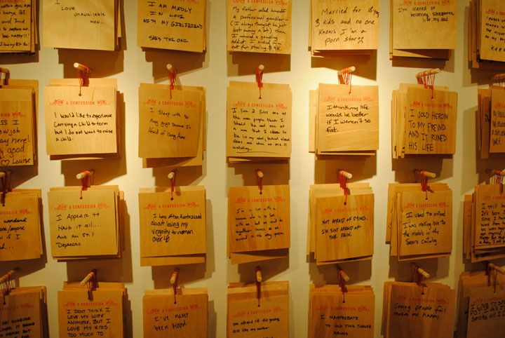

### parede🧱
```An anonymous website platform```

Builds a "wall"(a space to talk about a particular topic) where people can paste posts on anonymously.<br>

### features
- [x] create post on a particular wall
- [ ] likes and dislikes
- [x] generate unique usernames for wall creator/user
- [ ] user/wall creator authentication

